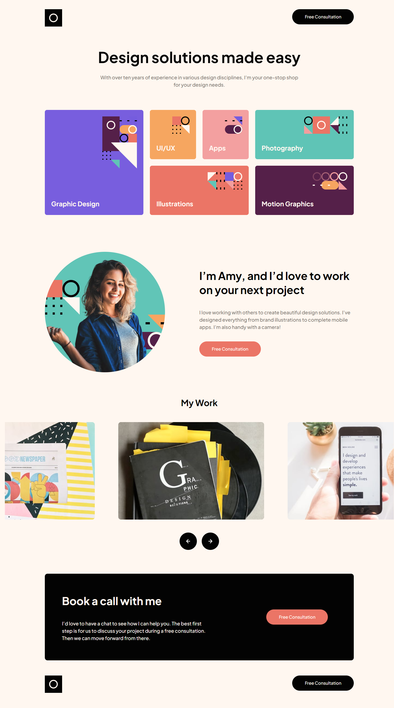

# Frontend Mentor - Single-page design portfolio solution

This is a solution to the [Single-page design portfolio challenge on Frontend Mentor](https://www.frontendmentor.io/challenges/singlepage-design-portfolio-2MMhyhfKVo). Frontend Mentor challenges help you improve your coding skills by building realistic projects. 

## Table of contents

- [Overview](#overview)
  - [The challenge](#the-challenge)
  - [Screenshot](#screenshot)
  - [Links](#links)
- [My process](#my-process)
  - [Built with](#built-with)
  - [What I learned](#what-i-learned)
  - [Continued development](#continued-development)
  - [Useful resources](#useful-resources)
- [Author](#author)


## Overview

### The challenge

Users should be able to:

- View the optimal layout for the site depending on their device's screen size
- See hover states for all interactive elements on the page
- Navigate the slider using either their mouse/trackpad or keyboard

### Screenshot




### Links

- Solution URL: [Add solution URL here](https://your-solution-url.com)
- Live Site URL: [https://flapshatner.github.io/design-port/](https://flapshatner.github.io/design-port/)

## My process

### Built with

- HTML5 markup
- CSS custom properties
- Flexbox
- CSS Grid
- Basic JavaScript 


### What I learned

I tried to keep the HTML and CSS organized and well structured. I began by bootstrapping the project with vite and installing the npm module Glide.js for the image slider. I then studied the design file and decided how best to structure the html to build the layout. 

The HTML was mostly straight-forward with no major complications. The trickiest part was deciding how to structure the section of blocks, but even that was mostly intuitive.

In the CSS I went with a mixture of grid and flex for the layout. I started out by using a CSS reset by Andy Bell. I also used CSS custom properties to write more convenient and maintainable code. Custom properties especially came in handy for colors and for font-size breakpoints like this:
```css
@media(max-width: 43em){
    :root{
        --fs-h1:2.25rem;
        --fs-h2:1.625rem;
        --fs-h3:1.5rem;
        --fs-body:1rem;
        --fs-button:.875rem;

    }
}
```

This is the first time I've really utilized CSS grid and I was pleased it turned out to be a lot more convenient than flex or anything else would have been. Here's some of the CSS I used when implementing it:
```css
.blocks{
    padding-block:5rem;
    display: grid;
    grid-template-columns: repeat(6, 1fr);
    grid-template-rows: 182px 182px;
    grid-template-areas: 
        'graphic graphic ui apps photo photo'
        'graphic graphic illus illus motion motion'
    ;
    gap:1.5rem;
 }
 ```
 For the image slideshow, I used a JavaScript slider called Glide.js. It was easy to incorporate into my project and easy to configure. Here is the entirety of my JavaScript for this project:

 ```js
 new Glide('.glide', {
  type: 'carousel',
  startAt: 0,
  perView: 1,
  gap: 27,
  peek: 420,
  breakpoints: {
    1280: {
      perView: 2,
      peek: 50,
    },
    1028: {
      perView: 1,
      peek: 175,
    },
    688: {
      perView: 1,
      peek: 37,
    },
  },
}).mount()
```
I implemented media queries to make the page fully responsive. I optimized the layout and font sizes for desktop, tablet, and mobile views. The most complicated task I came upon was making the profile image display the correct aize and in the right place at all viewpoint widths. I think there is a better way than what I did (a somewhat complicated assortment of margins and media queries) and it's something I want tp practice.

In all the project was somewhat challenging and it was fun to get as close tp pixel-perfect as possible to the designs.


### Continued development

I'd like to learn accessibility best practices and to practice writing clean, well-structured code. I also plan to practice using a checklist to make sure my projects are compliant and optimized for search engines and easily maintained. 

### Useful resources

- [CSS-Tricks Guide to Grid](https://css-tricks.com/snippets/css/complete-guide-grid/) - This guide from CSS-Tricks about CSS grid was pivotal in figuring out how to use the grid system. CSS-Tricks as a priceless resource.
- [Glide.js Docs](https://glidejs.com/docs/) - This is the documentation for Glide.js which I used for the image slider on this project. The docs are comphrensive and easy to understand.


## Author

Jordan Roberts

- Github - [Jordan Roberts](https://github.com/FlapShatner)
- Frontend Mentor - [@FlapShatner](https://www.frontendmentor.io/profile/FlapShatner)
- Twitter - [@jRobertsWebDev](https://twitter.com/jRobertsWebDev)


